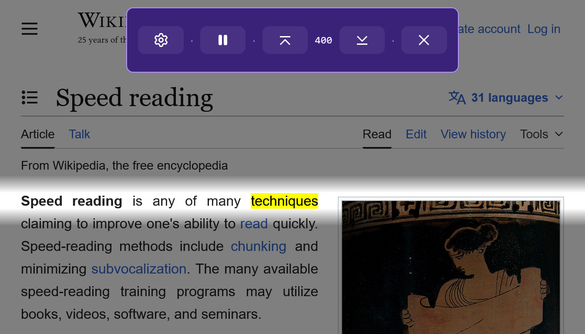

# [Yet Another Speed Reader](https://addons.mozilla.org/en-US/firefox/addon/yet-another-speed-reader/)

Yet another Firefox extension for speed reading.

## How do I use this?

Right click on text in any page and choose "Speed Reader".

### Keyboard shortcuts

- [Spacebar] Pause/resume speed reading
- [Escape] Close the speed reader
- [←] / [→] Move one word forward/backwards (pauses the session)
- [↑] / [↓] Increase / decrease your reading pace (Words-per-Minute)

### Firefox for Android support

This extension has **experimental** support for Firefox for Android. To use it,
select some text, then choose the extension from the [⋮] menu.

## Privacy

The extension does not collect any data.

## Contributions welcome!

I'm developing this extension in my free time. Saying that, please report any
issues and feature requests here on GitHub, or send me pull requests, and I'll
try to get back to you as soon as possible!

Another way to contibute is to help with translations. Either by sending a pull
request with a new `messages.json` file as described in MDN's documentation on
[Internationalization](https://developer.mozilla.org/en-US/docs/Mozilla/Add-ons/WebExtensions/Internationalization#Providing_localized_strings_in__locales),
or by using the
[Web Extension Translator](https://lusito.github.io/web-ext-translator?gh=https://github.com/danielrozenberg/yet-another-speed-reader)
online tool and submitting the translation on GitHub with the (→) right arrow
button on the top.

## License

_Yet Another Speed Reader_ is licensed under an [ISC license](LICENSE).
